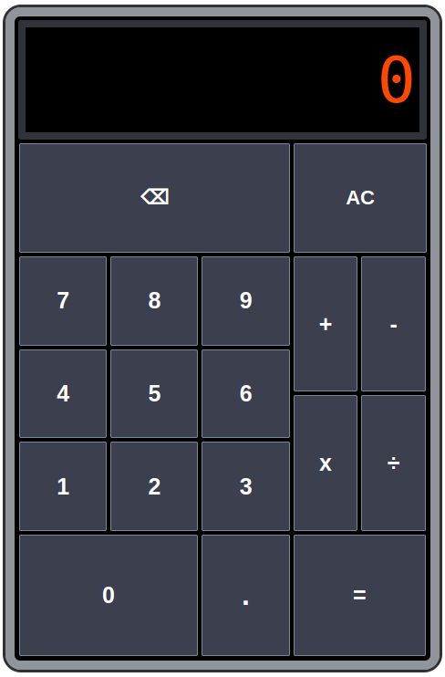

# odin-calculator
The capstone project for The Odin Project Foundations path: A simple calculator built from scratch. The calculator features keyboard support. Since it's a simple calculator, it does not accommodate more than 10 characters in the display and it rounds decimal results to the tenths place. If the result of an operation exceeds 10 characters after rounding any decimals, or if the user attempts to divide by 0, an error message is alerted and the calculator is reset.

[Live Demo](https://kezy-d4.github.io/odin-calculator/)

# Interface

